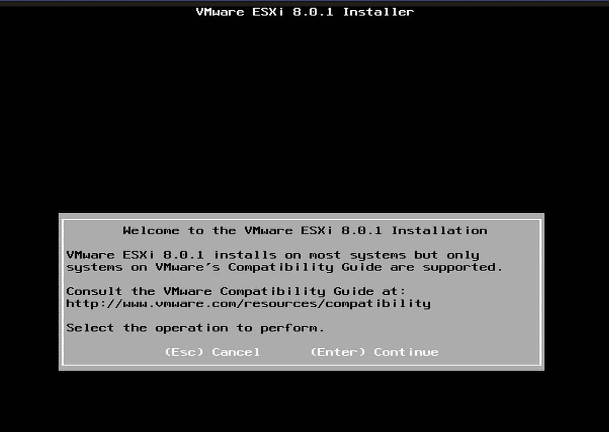
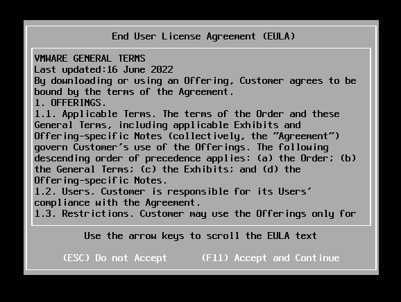
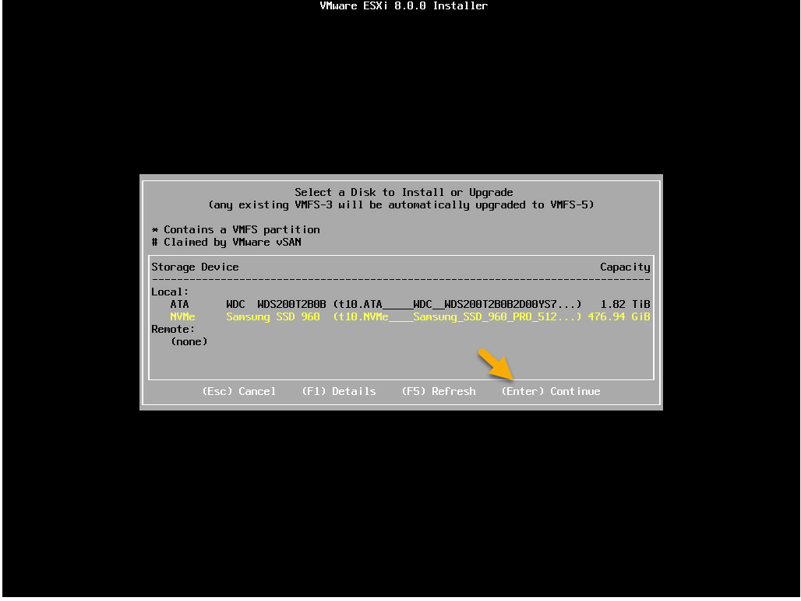
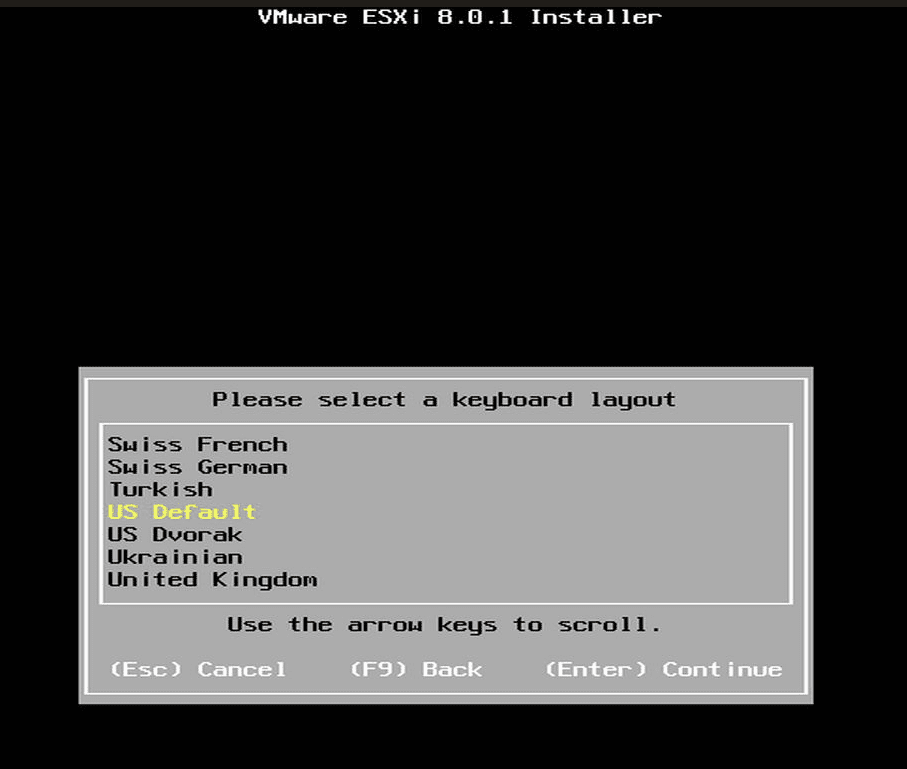
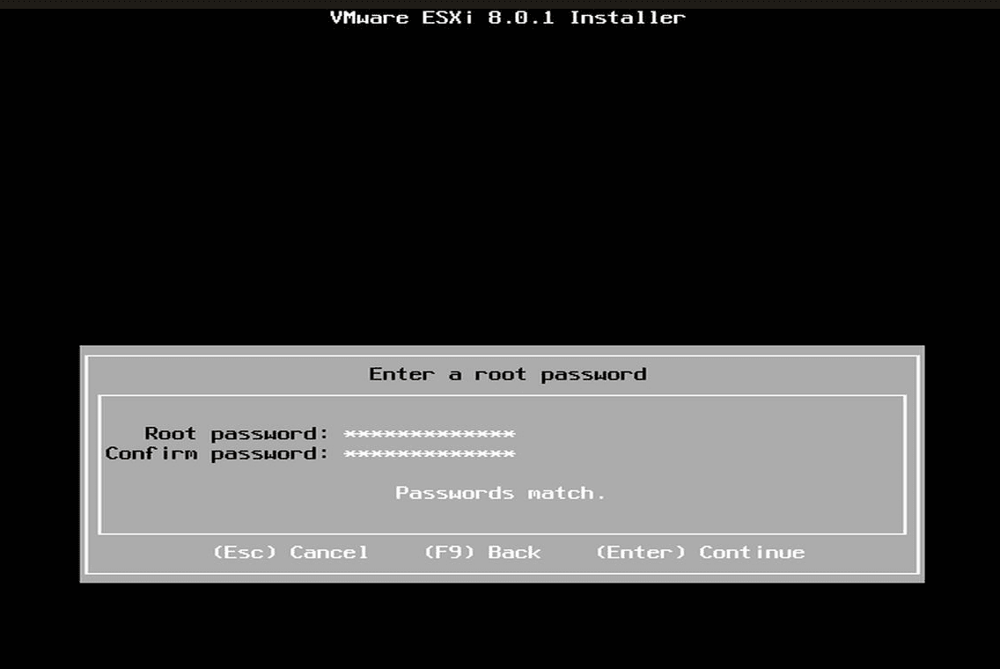
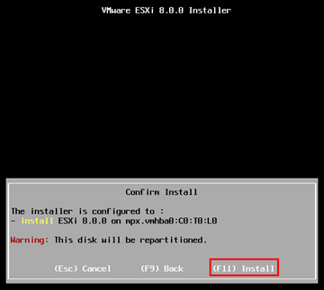
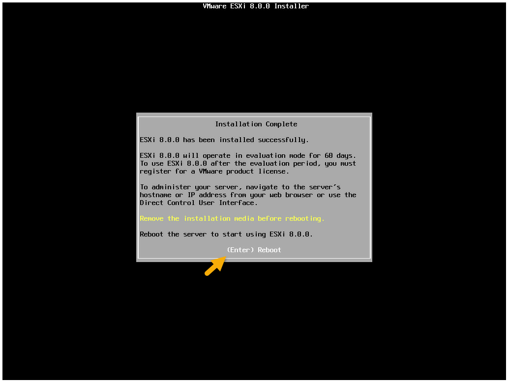

# VMware ESXi8

In this repository I will be guiding you through the **Installation** and **Configuration** process for **VMware ESXi VSphere8**

With this guide you will be able to:

- Download VMware ESXi8 image<br>
- Check ISO image Compatability & Requirements<br>
- Create Bootable Media for ISO image<br>
- Modify Required Bios/UEFI Settings<br>
- Install VMware ESXi8 image on a Host Machine

***
## Pre-Installation

1. Please Check the [VMware ESXi Compatability Guide](https://www.vmware.com/resources/compatibility/search.php) to Confirm Compatability with your System

2. ESXi 8.0 [Hardware Requirements](https://docs.vmware.com/en/VMware-vSphere/8.0/vsphere-esxi-installation/GUID-DEB8086A-306B-4239-BF76-E354679202FC.html)
  
2. Download the [VMware vSphere Hypervisor (ESXi) Image](https://customerconnect.vmware.com/evalcenter?p=vsphere-eval-8)

4. Format a **Bootable** Device (USB, CD, etc.)
   
   #### WINDOWS

   - [RUFUS](https://rufus.ie/en/)
  

   #### LINUX

   - [Fedora Media Writer](https://developers.redhat.com/blog/2016/04/26/fedora-media-writer-the-fastest-way-to-create-live-usb-boot-media)
   - [Etcher](https://etcher.balena.io/)

#### _Linux Terminal_  
   
1. **Open a terminal**
2. **Identify the USB Drive:** Use the `lsblk` command to identify the device name of your USB drive
```
lsblk
```
3. **Create the Bootable USB Drive Using `dd`:** Replace /path/to/esxi.iso with the actual path to your VMware ESXi ISO file and /dev/sdX with the device name of your USB drive:
```
sudo dd if=/path/to/esxi.iso of=/dev/sdX bs=4M status=progress
```
4. **Eject the USB drive:** After the process is complete, you can safely eject the USB drive:
```
sudo eject /dev/sdX
```
***
### Configuring the BIOS [Boot Settings](https://docs.vmware.com/en/VMware-vSphere/8.0/vsphere-esxi-installation/GUID-1298D6CC-B7B4-41EE-8F7E-98C58404F133.html)
***
## Installation
**Step 1:** Begin the ESXi 8 Installation  
<br>

```
(Enter) Continue
```
***
**Step 2:** Accept the End User License Agreement (EULA)  
<br>

```
(F11) Accept and Continue
```
***
**Step 3:** VMware ESXi will now scan your device for available **Storage Devices**  
<br>

```
Select Your Storage Device
```
***
**Step 4:** Select a Keyboard Layout  
<br>

```
(Enter) Continue
```
***
**Step 5:** Enter a Root Password  
<br>

```
(Enter) Continue
```
***
**Step 6:** Confirm Install  
<br>

```
(F11) Install
```
***
**Step 7:** Reboot Your System  
<br>

```
(Enter) Reboot
```
